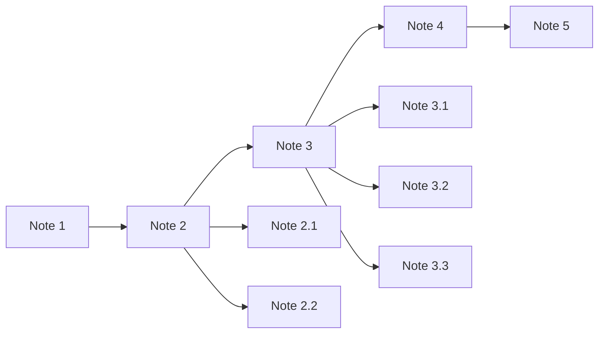
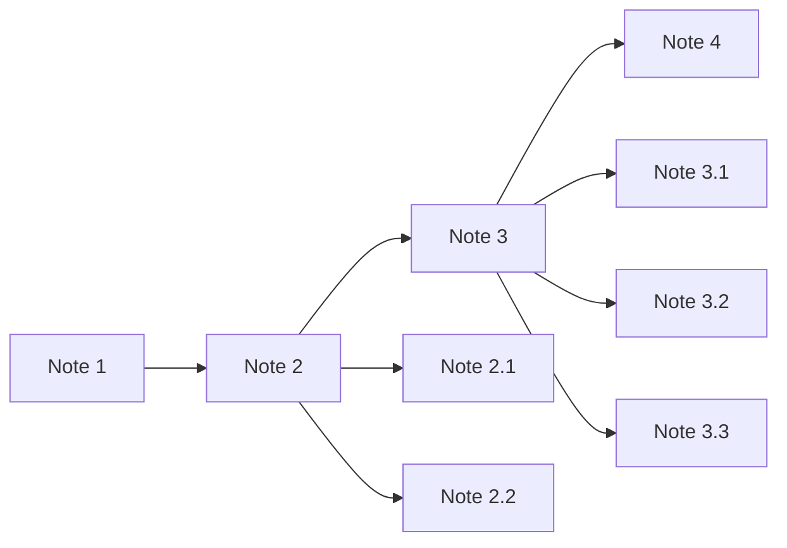

# Backlinks

Lets talk about `[[links]]`. You know what it is: *A connection between notes*. Now, there are different ways you can see this connections:
- You can use the **global graph** (`CTRL+G`), which will show you all the notes, tags and connection between them. But this will get "useless" over time, since you'll be working with a lot of notes and tags (and attachments/documents).
	- So maybe you want to use the **local graph** (`CTRL+P` and write *Open Local Graph*^[If you want to open the view on another pane instead of the one that you are using/reading, instead of pressing `Enter`, press `CTRL+Enter`]).
	- You'll see that is a "simplification" of the **global graph**, because it's showing you a small part of said graph. If you open the settings and expand the *Filters* section, you'll see a bunch of options, being the `Depth` the more important (arguably) of them all.
	- This `Depth` will display how many connections/layers of dot-notes to show you.

Let use an example to better understand the concept of `Depth`. Lets say we have 5 notes and their relationship between them is as follows:

If you had open the local graph for the first time, the `Depth` should be set up to 1. This means the only dot-notes that will show up are the next ones:

It will show you all the notes that are 1 link-note of distance. The more `Depth` that you choose the *local graph* to show you, the more "layers"/connections of notes will show you.

Let say that you add more notes to your vault, and you end up with the next connections:

If you set the `Depth` of your local graph to be 3, the next dot-notes should appear:

If you don't get the idea, try it with this vault documentation. Now that you are on the [[Backlinks]] note, open its *local graph*^[The local graph will change depending on which note you are, so you don't need to open a new *local graph* every time you want to see its local graph] and see for yourself. Try it out 😄.

---

But maybe this way of seeing things are too graphic for your liking, and you maybe just want to see a list of files which connects to your note. The `[[links]]` connect 2 notes, but in one way. Let us work with the following example:

Inside the `Note 1` there is a link to `Note 2`. This link work in one way, meaning you can access to `Note 2` through the created link inside `Note 1`, but not vice versa. If you where to create another link inside the `Note 2` to `Note 1`, then you have the following connections:

Bare in mind that Obsidian doesn't render on any of their graphs a link for every direction/way of the connections, but adds an arrow to every edge of said connection, symbolising the direction/way of that connection. If the connection only goes one way, that means only one arrow, but if it goes both ways, that means 2 arrow on both ends in the same connection.

Now, why does this matter? Well, Obsidian can list you 2 types of links: **Backlinks** and **Outgoing links**. You can see both of this type of link on the right panel (`CTRL+A`), and first 2 icons that appear on the top left side of the panel, next to the minimise, maximise and close buttons.

- **Backlinks** - Shows you a list of all notes that have links that point to the actual note that you are editing/reading.
- **Outgoing links** - Shows you a list of all the notes that your actual note is linking to.